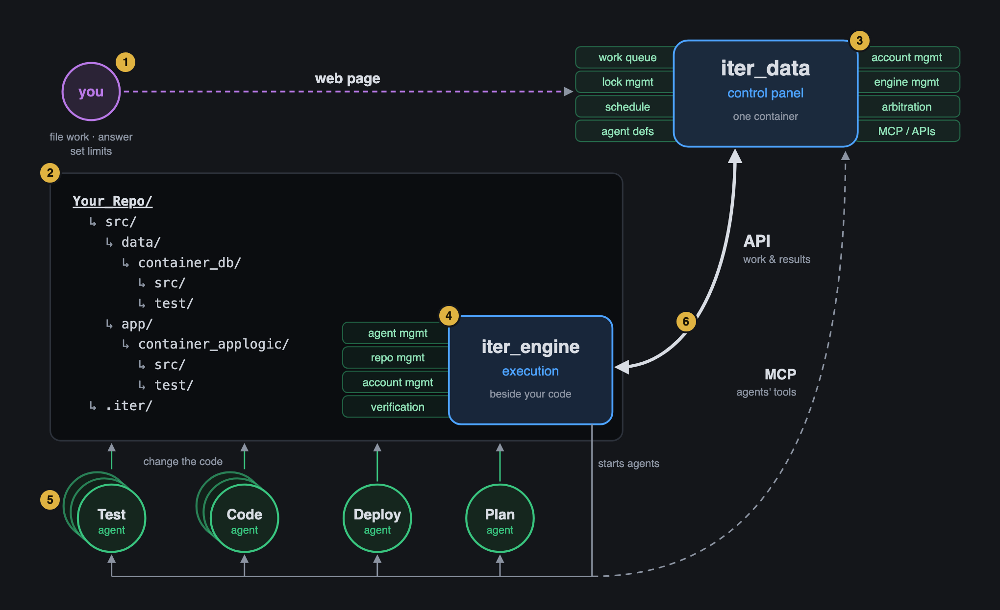
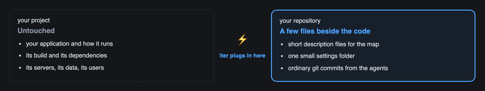
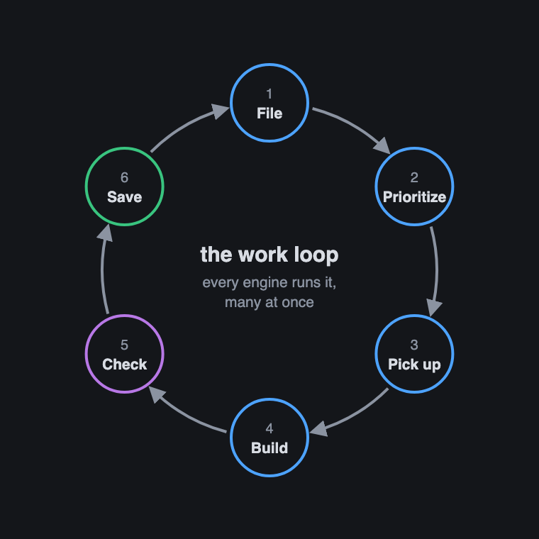
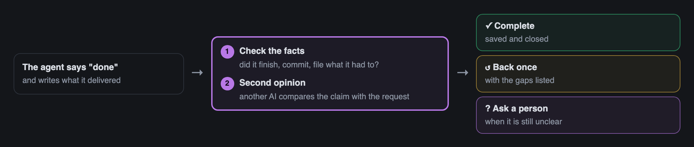
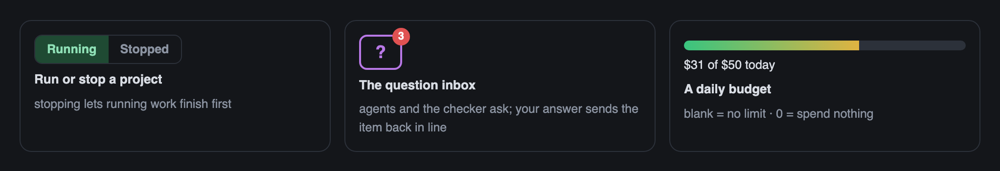
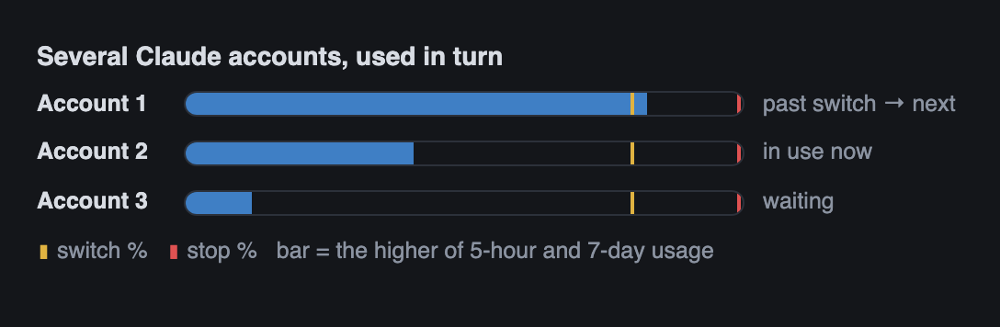
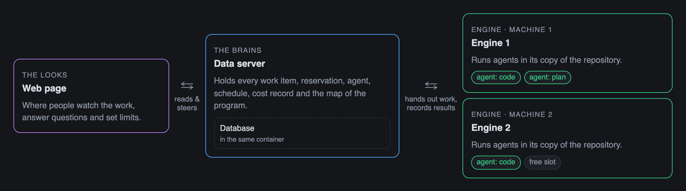
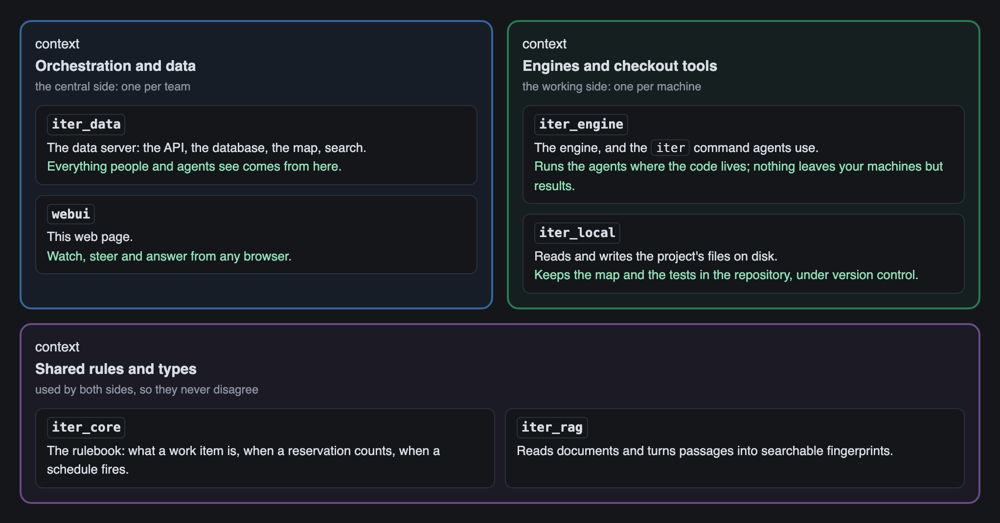

# iter

**A team of AI coding agents on your software, with a foreman.**

You describe the work. iter hands it to Claude Code agents running on your machines, keeps them out of each other's way, checks what they deliver, and asks you when it matters. Agents plan, write code, write tests, deploy, and file follow-up work for each other. People steer from a web page: they file requests, answer questions, set limits, and watch each use case move toward done.

The current generation is **iter4** ([`iter4/`](iter4/)): one container (the `iter_data` server + ArangoDB), any number of engines, a web page with a work queue, a map of the program, and document search. The pictures below come from the web page's own Intro tab.



Getting a project going, step by step (the numbers on the picture):

1. **You** set requirements, describe the work, and define or refine the tests that say what "done" means.
2. **Your repo:** create your repository, drop in `iter_engine`, and connect it to `iter_data`.
3. **iter_data:** refine your requirements and tests, and optionally lay out the project's high-level design in the Project graph.
4. **iter_engine:** set it up and turn it on. It starts processing work items.
5. **Agents** work off each other's results to create plans, code, tests and more, using the MCP server in `iter_data`.
6. **Kept in sync:** work is synced between one central `iter_data`, any number of engines, and any number of Claude accounts.

## It plugs into your repo, not your project



There's no library to install, no code to change, and nothing to deploy with your product. Everything iter adds is plain text you can read and review: `*.iter.md` node files that describe the parts of the program, `main.iter.md`, and `.iter/config.json` (plus a token in `.env`). The engine works in a checkout through ordinary git pull, commit and push. It works with any language or stack. Remove iter and your software doesn't notice.

## Every piece of work travels the same loop



A **work item** is like a ticket: a title, the request, a priority, the folders it may change, and a history of everything that happened to it. Finished work often files the next work, so it loops.

1. **File.** Work is described: a first big request, or ongoing work as it comes up. People and agents both file work, and one big request is broken into many small items.
2. **Prioritize.** A number from 0 to 99 decides the order, and lower goes first. Related work shares one number, so it moves together.
3. **Pick up.** A free engine takes the most important item that can run now. Items that must wait say why in the queue.
4. **Build.** A Claude Code agent does the work in its copy of the repository. Several agents build at once, each inside the folders it reserved.
5. **Check.** A checker confirms the work matches the request.
6. **Save.** The change is committed and pushed, and the item closes. Every step is recorded on the item: request, replies, checks, cost.

<br clear="right">

## Many agents, one codebase, no collisions


Three rules let a dozen agents share one codebase:

- **Reserve** the folders you change. It works like booking a meeting room: a crashed machine's booking expires on its own.
- **Wait** for the work you need, and for everything that work created. Loops are refused when they're written, with the path named.
- **Go in order.** Everything an item creates inherits its number exactly, so a use case runs through as one block.

When something waits, the queue says why: which reservation, which item, which limit.

## Done means checked



An agent stopping is not the work being finished. Every agent ends by saying what it delivered, plus a `NOT DONE:` line for anything it didn't finish. An honest gap costs one quick retry; a hidden one is exactly what the checker catches. Test groups run on a schedule, and a group that turns red files **exactly one** item to fix it, never one per run.

## People steer; agents do the legwork



You set the direction, the limits and the tie-breaks, and iter enforces them. Stopping a project lets running work finish first. Agents and the checker ask questions in an inbox, and your answer sends the item back in line. A daily budget caps spend (blank means no limit, `0` means spend nothing).



Several Claude accounts can serve one project. Each account has a **switch** level, where iter moves on to the next account, and a **stop** level, which it never goes past. Fewer agents run as usage climbs, and when every account is at its stop level, iter pauses until usage resets.

## Where it runs



Only the engines touch your code, and only the data server touches the database. Your code stays in your git repository, on machines you choose. The data server runs on a laptop or a small cloud machine and starts with one command.

## What it's built from



| path | what |
|---|---|
| `iter4/iter_data` | the data server: axum HTTP API and MCP (`/mcp`) over ArangoDB; auth and roles, locks, versioned writes, the architecture map, GraphRAG search; serves the web page |
| `iter4/webui/` | the web page (Intro, Work queue, Project graph, GraphRAG), plain JavaScript, built into the `iter_data` binary |
| `iter4/iter_engine` | the engine (5-second tick, `claude -p` sessions, close gate, map and document sync) and the `iter` command agents use |
| `iter4/iter_local` | checkout-side tools: node-file scan and ids, map snapshot, testgroups and the test runner, validation, graph edits |
| `iter4/iter_core` | the rulebook: work item states, priorities, waits, dedup keys, schedules |
| `iter4/iter_rag` | document extraction (pdf including scans, docx, pptx, html, md), chunking, the embedding model |
| `iter4/docker/` | the all-in-one image: ArangoDB Community Edition + `iter_data` |
| `iter4/tools/iter_engine_setup.sh` | sets up and starts an engine for one project |
| `iter4/docs/` | [`iter4_guide.md`](iter4/docs/iter4_guide.md) (questions and answers) and [`iter4_spec.md`](iter4/docs/iter4_spec.md) (spec and build plan) |
| `src/.iter/agents/` | the agent prompts, shared rules and capabilities |
| `iter3/` | the previous generation (DynamoDB behind a Lambda); its data was migrated into iter4 |
| `sampleV3/` | a small sample project (the end-to-end tests run against it) |
| `src/`, `tests/` | the V2 engine, kept for reference |

## Get started

**1. Start the server** (API and web page on :8300; secrets `ITER_ADMIN_PASSWORD` and `ITER_JWT_SECRET` come from the repo `.env`):

```bash
cd iter4 && ./deploy.sh docker
open http://127.0.0.1:8300/        # admin / ITER_ADMIN_PASSWORD
```

**2. Create a project.** In the web page, open **Intro → Start a new project**. The wizard asks for a name, the checkout folder, the Claude accounts and the limits, then shows the engine setup.

**3. Set up an engine** on the machine that holds the code. On its last page the wizard mints an engine token and prints this command with every value filled in. The work queue's **Engine setup** button shows it again whenever no engine is online for a project.

```bash
curl -fsSLo iter_engine_setup.sh http://127.0.0.1:8300/iter_engine_setup.sh
# or: https://raw.githubusercontent.com/Stephen-Hilton/iter/main/iter4/tools/iter_engine_setup.sh
bash iter_engine_setup.sh --data-url http://127.0.0.1:8300 --project my-app --engine Engine01 \
  --topdir ~/dev/my-app --token <engine token> --start
```

The script checks for git, curl and the `claude` CLI, and finds `iter_engine` (or builds it with cargo). It scaffolds `main.iter.md` and `.iter/config.json`, writes `.env` with the engine token and one token per Claude account (from `claude setup-token`, or copied with `--env-from`), then starts the engine and waits for it to check in. It never overwrites a file. Afterwards, `--status` and `--stop` manage the engine it started.

**4. Press Running** on the project in the work queue, and file a first work item.

More: [`iter4/README.md`](iter4/README.md) (running and the web app), [`iter4/docs/iter4_guide.md`](iter4/docs/iter4_guide.md) (the full guide), [`iter4/UBUNTU.md`](iter4/UBUNTU.md) (a Linux engine).

## Tests

```bash
cd iter4
cargo test --workspace         # unit tests
./deploy.sh local && ./e2e.sh  # a real server and engine end to end, on a throwaway database
```

## Notes

- Agents run with `--dangerously-skip-permissions`. Their write fence is the item's reserved folders and the engine's locks, not Claude's permission prompts.
- Every prompt, capability and pre/post step is a markdown file. The central copies live on the server, so every engine assembles the same prompt.
- The README images are captures of the web page's Intro tab (`iter4/webui/intro.js`). Retake them after changing a slide.
- This repository was named `iterapp` until 2026-09-08.
